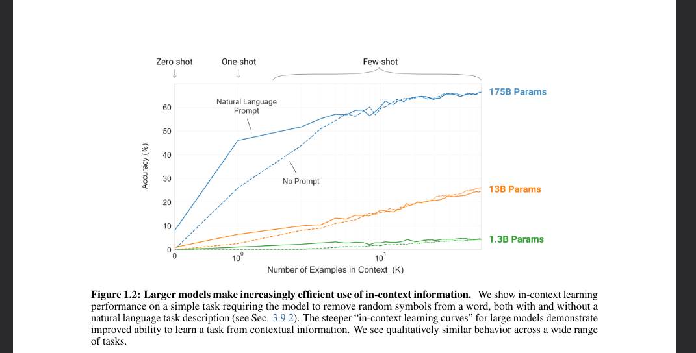

# Prompt eng notes

Prompt engineering wikipedia article: [2021-10-21](https://en.wikipedia.org/w/index.php?title=Prompt_engineering&oldid=1050870205)

> Prompt engineering is a concept in artificial intelligence, particularly
> natural language processing (NLP). The idea with prompt engineering is to
> embed the description of the task in the input, e.g., as a question instead
> of it being implicit given.


## What is a Prompt?

It is an input.

## Why does it work?

Few shot learning (2020).

> While typically task-agnostic in architecture, this method still requires
> task-specific fine-tuning datasets of thousands or tens of thousands of
> examples. By contrast, humans can generally perform a new language task from
> only a few examples or from simple instructions – something which current
> NLP systems still largely struggle to do. Here we show that scaling up
> language models greatly improves task-agnostic, few-shot performance,
> sometimes even reaching competitiveness with prior state-of-the-art fine-
> tuning approaches

[...]

> However, a major limitation to this approach is that while the architecture
> is task-agnostic, there is **still a need for task-specific datasets and
> task-specific fine-tuning**: to achieve strong performance on a desired task
> typically requires fine-tuning on a dataset of thousands to hundreds of
> thousands of examples specific to that task. Removing this limitation would
> be desirable, for several reasons

[](https://arxiv.org/pdf/2005.14165#page=4)


## Techniques

## Templates

## How to keep your logs

## Experiences?

### A software developers questions

* [Nightjet](https://github.com/miku/nightjet), ongoing exploration of topic, [chats](https://github.com/miku/nightjet/tree/main/chats)


## Examples

### MARC subject headings

Original MARC record, yaz-marcdump output:

```
00714cam a2200205 a 4500
001 12883376
005 20030616111422.0
008 020805s2002    nyu    j      000 1 eng
020    $a 0786808772
020    $a 0786816155 (pbk.)
040    $a DLC $c DLC $d DLC
100 1  $a Chabon, Michael.
245 10 $a Summerland / $c Michael Chabon.
250    $a 1st ed.
260    $a New York : $b Miramax Books/Hyperion Books for Children, $c c2002.
300    $a 500 p. ; $c 22 cm.
520    $a Ethan Feld, the worst baseball player in the history of the game, finds himself recruited by a 100-year-old scout to help a band of fairies triumph over an ancient enemy.
650  1 $a Fantasy.
650  1 $a Baseball $v Fiction.
650  1 $a Magic $v Fiction.
```

* https://chat-ai.academiccloud.de/chat/0e300385-a9f3-4b41-b78b-052b90f08092 (Mistral Large)
* https://claude.ai/share/42377af7-a21d-4357-a3b2-74d3dd7855a8 (Sonnet 3.7)

Closed model Sonnet 3.7:

```
650  0 $a Baseball $v Juvenile fiction.
650  0 $a Fantasy fiction $v Juvenile fiction.
650  0 $a Fairies $v Juvenile fiction.
650  0 $a Magic $v Juvenile fiction.
650  1 $a Baseball stories.
650  1 $a Fantasy.
```

Open weights model Mistral Large:

```
650  0 $a Baseball stories.
650  0 $a Fairies $v Fiction.
650  0 $a Fantasy fiction.
650  0 $a Magic $v Fiction.
650  0 $a Adventure stories.
```

### Grammar and wording

Writing assistant, e.g. [slides from a previous presentation](https://raw.githubusercontent.com/miku/ubl-wd-2024-pe/main/UBL-WD-2024-PE-MC.pdf#page=20)

### Translation of a short text

It is not necessary to say what the source language is.

Original:

> Das Open Science Office an der Universitätsbibliothek Leipzig bietet
> forschungsunterstützende Dienstleistungen für **Wissenschaftlerinnen und
> Wissenschaftler** der Universität Leipzig. Wir arbeiten eng mit anderen
> Einrichtungen der Universität zusammen, insbesondere mit dem Dezernat für
> Forschung und Transfer und dem Universitätsrechenzentrum. Unsere Schwerpunkte
> sind die Themen Open Access und Forschungsdaten. Darüber hinaus koordinieren
> wir die Publikationserfassung für leuris, das Forschungsinformationssystem
> der Universität Leipzig.

German to Hungarian:

> A Lipcsei Egyetemi Könyvtár Open Science Office-a tudományos kutatást
> támogató szolgáltatásokat nyújt a Lipcsei Egyetem **kutatóinak**. Szorosan
> együttműködünk az egyetem más intézményeivel, különösen a Kutatási és
> Transzfer Osztállyal és az Egyetemi Számítástechnikai Központtal. Fő
> területeink a nyílt hozzáférés és a kutatási adatok. Emellett koordináljuk a
> publikációk rögzítését a leuris, a Lipcsei Egyetem kutatási információs
> rendszerébe.

* https://chat-ai.academiccloud.de/chat/e1f2b336-ea9b-4a00-834c-adb072da64bf

Hungarian to German:

> Das Open Science Office der Universitätsbibliothek Leipzig bietet
> wissenschaftliche Forschungsunterstützung für **Forscher** der Universität
> Leipzig an. Wir arbeiten eng mit anderen Einrichtungen der Universität
> zusammen, insbesondere mit der Abteilung für Forschung und Transfer sowie dem
> Universitätsrechenzentrum. Unsere Hauptbereiche sind Open Access und
> Forschungsdaten. Darüber hinaus koordinieren wir die Erfassung von
> Publikationen in leuris, dem Forschungsinformationssystem der Universität
> Leipzig.

* https://claude.ai/share/8a753ac8-f845-40e8-9edd-2cea6ec98fd5

It could be that Hungarian has [no concept of gender](https://en.wikipedia.org/wiki/Hungarian_noun_phrase#Grammatical_gender).

### Grammar checks

### Explain a configuration section in git

* https://claude.ai/share/8a676227-227d-4646-ad50-ea1abb8465a5


## Hacks

### PLeak


